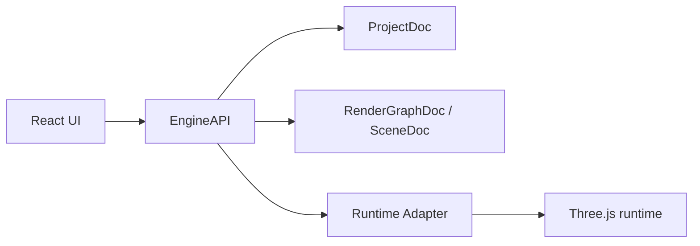
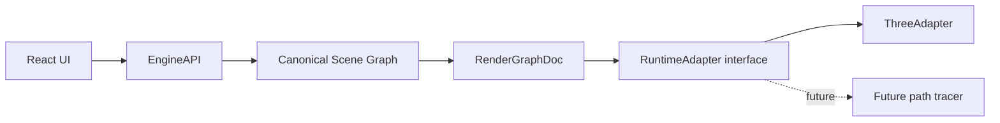

# three-motion-base

`three-motion-base` is a React, TypeScript, and Vite application for authoring and exporting high-fidelity Three.js product scenes.

It is built around a studio workflow:

- load a GLB/GLTF product
- edit transforms, materials, lights, environment, filters, and post-processing
- preview the result in a Three.js viewport
- animate product, camera, and light targets
- export PNG renders
- preserve edits through undo and redo

The repo context and domain vocabulary live in [CONTEXT.md](./CONTEXT.md). The canonical migration plan lives in [IMPLEMENTATION_PLAN_SPEC.md](./IMPLEMENTATION_PLAN_SPEC.md).

## Scope

The current product scope is intentionally focused.

In scope:

- product scene loading and replacement
- studio scene setup
- look and lighting controls
- animation timeline editing
- runtime preview and PNG export
- undo / redo across canonical edits

Not the long-term goal, but still in active migration:

- canonical scene graph ownership
- explicit runtime adapter boundaries
- removing remaining direct Three.js usage from the UI
- future path-tracer readiness

## Current State

The app already separates durable project state from runtime rendering, but the migration is still in progress.

Current facts:

- `ProjectDoc` owns durable studio intent.
- `SceneDoc` is the current implementation name for the assembled render graph.
- `EngineAPI` is the main entry point used by the UI.
- `ThreeAdapter` is the active runtime adapter.
- the UI still contains some direct Three.js coupling in a few places, which is called out in `CONTEXT.md`.

## Current Architecture

This is the architecture the code currently follows:



Current responsibilities:

- the React UI sends user intent to `EngineAPI`
- `EngineAPI` updates project state and assembles render state
- `RenderGraphAssembler` turns project setup plus mounted assets into the renderer-facing graph
- `ThreeAdapter` realizes the graph into Three.js objects and handles runtime rebuilds and dirty patches

## Intended Architecture

The target direction is a stricter canonical-first boundary:



The intended rules are:

- React should not depend on runtime `THREE.*` objects.
- canonical authoring state should be the source of truth.
- runtime adapters should be replaceable implementation details.
- undo, redo, save, load, and rebuild should operate from canonical state, not renderer object state.

## Domain Model

Key terms used in this repo:

- `ProjectDoc`: saved product-studio project state.
- `StudioSceneDoc`: durable studio setup containing product slots, cameras, lights, studio geometry, environment, and materials.
- `AssetGraphDoc`: reusable imported or bundled graph-shaped 3D content.
- `RenderGraphDoc`: assembled renderer-facing graph derived from project state and mounted assets.
- `RenderGraphMount`: placement of an asset graph into the assembled render graph.
- `Mount Overrides`: project-owned edits applied to mounted content.
- `Studio Set`: a coarse studio mount in the MVP.
- `Animation Target`: product, camera, or active light.
- `Runtime Adapter`: boundary between engine state and a concrete renderer.

## Repository Layout

- `src/App.tsx`: application shell and mode switching.
- `src/engine/EngineAPI.ts`: application-facing engine surface.
- `src/engine/project/`: durable project document, presets, and timeline editing.
- `src/engine/renderGraph/`: assembly of project state into renderer-facing graphs.
- `src/engine/runtime/`: runtime adapter interface and runtime helpers.
- `src/engine/runtime/three/`: Three.js runtime adapter implementation.
- `src/engine/assets/`: GLTF loading and import normalization.
- `src/engine/scene/`: canonical scene graph types, snapshot helpers, diffing, and mutations.
- `src/ui/`: React panels, viewport, and editor surfaces.
- `tests/engine/`: behavior tests for project, render graph, runtime, and loading flows.

## Bundled Assets

The repository includes a small set of built-in runtime assets:

- `public/models/sample.glb`
- `public/models/room/source/Untitled.glb`
- `public/hdri/studio.hdr`
- `public/hdri/moody.hdr`
- `public/hdri/daylight.hdr`

## Validation

Common checks:

```bash
npm run build
npx -y tsx --test tests/engine/*.behavior.test.ts
```

For browser verification, see `scripts/browser-smoke.mjs`.

## Notes For Contributors

- Keep changes incremental and commit-friendly.
- Prefer behavior tests in `tests/engine/` for engine and runtime changes.
- Avoid adding new direct Three.js dependencies in the UI unless there is an explicit migration reason.
- Treat `CONTEXT.md` and `IMPLEMENTATION_PLAN_SPEC.md` as the current source of architectural truth.
